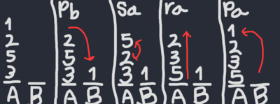

# 42push_swap

## Because swap_push isn’t as natural


It is a classic algorithmic project focusing on sorting data efficiently. The program takes an unsorted list of integers as input and sorts them in ascending order using only two stacks and a limited set of operations. 

Like this, for example:

 ```./push_swap "10 -5 15 2 99 0"```, works with numbers as arguments too: ```./push_swap 10 -5 15 2 99 0```

Starting with all the numbers in stack **A**, and an empty stack **B**. The allowed operations for this project include:
  - `sa`: swap a - swap the first two elements of stack **A**
  - `sb`: swap b - swap the first two elements of stack **B**
  - `ss`: swap both - swap the first two elements of both stacks **A** and **B**
  - `pa`: push a - take the first element from stack **B** and put it on top of stack **A**
  - `pb`: push b - take the first element from stack **A** and put it on top of stack **B**
  - `ra`: rotate a - shift all elements of stack **A** up by one. The first element becomes the last one
  - `rb`: rotate b - shift all elements of stack **B** up by one. The first element becomes the last one
  - `rr`: rotate both - rotate both stacks **A** and **B** at the same time
  - `rra`: reverse rotate a - shift all elements of stack **A** down by one. The last element becomes the first one
  - `rrb`: reverse rotate b - shift all elements of stack **B** down by one. The last element becomes the first one
  - `rrr`: reverse rotate both - reverse rotate both stacks **A** and **B** at the same time

The objective is to sort the integers in Stack **A** in ascending order using only the permitted moves outlined above, and to achieve this in the fewest moves possible. The program will output each executed move to **STDOUT**, followed by a newline. Upon completion of the push_swap program, Stack **A** should be sorted, and Stack **B** should be empty.

Example:

```
./push_swap 1 2 5 3
pb
sa
ra
pa
```
Visualization:



Explanation:
  - pb, push the element on the top of stack **A** to stack **B**
  - sa, swap the first two elements of stack **A**
  - ra, rotate elements in stack **A**, making the first element the last
  - pa, push the first element of stack **B** to stack **A**

What comes for the actual algorithm, I decided to build my own, heavily influenced by this ***[post](https://medium.com/@ayogun/push-swap-c1f5d2d41e97)*** by **Yidit Ogun**.
It sorts a random list of **500** values using an average of just over **5000** instructions, ranking it among the most efficient push_swap projects in our curriculum.

The gif above uses a ***[visualizer](https://github.com/o-reo/push_swap_visualizer)*** to help illustrate how stack **A** gets sorted.

This was my sixth project in **Hive Helsinki** and it introduced **Algorithms** and the concept of **Complexity**.
I actually completed this task in mid **2023**, but I wanted to redo the commit history and make some minor changes.

## 📖 Topics
  - Algorithms
  - Optimization
  - Data structure: stack
  - Memory management
  - Unit testing

## 🛠️ Langs/Tools
  - C
  - Makefile

## 🦉 Getting started

  1. ```git clone https://github.com/kenlies/42push_swap```
  2. ```cd 42push_swap```
  3. ```make```
  4. ```./push_swap [numbers]```

     **and**
     
     ```./checker [numbers]``` for the bonus checker program (run before push_swap with the same input)

## 💸 Bonus section

Due to its simplicity, this project leaves little room for bonuses. However, we needed to write a checker for the push_swap program. 
The checker verifies whether the sequence of instructions output by push_swap successfully sorts the stack and ensures that Stack **B** is empty as required. 
It reads the instructions from **STDOUT** provided by push_swap, executes them, and then prints either **OK** or **KO** based on the result. The checker takes the same arguments as the push_swap program.

## 🔨 To improve

There is definitely some room for improvement in code quality. For example some code blocks/functions are redundantly repeated with minor differences. The file structure can be orgnized better by adding all the source files under one directory.
